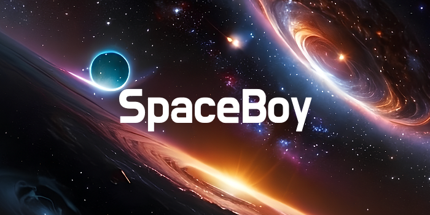

# Overview
Welcome to the SpaceBoy, an interactive application built with React and React Three Fiber. This project allows users to explore the solar system and ask questions about space. Our virtual guide, powered by the OpenAI API, provides informative and engaging responses to your queries.

## Features
- **Interactive 3D Solar System**: Explore the planets and other celestial bodies in our solar system.
- **Space Guide**: Ask questions about space, and get responses from our AI-powered guide.

## Usage
- **Explore the Solar System**: Use your mouse or touch gestures to navigate through the 3D model of the solar system.
- **Ask Questions**: Type your questions about space in the input box, and our space guide will provide answers.

## Technologies Used
- **React**: A JavaScript library for building user interfaces.
- **React Three Fiber**: A React renderer for Three.js, enabling complex 3D visualizations.
- **OpenAI API**: An API for accessing OpenAI's powerful language models.

## Motivation
I was always fascinated with space, I recall as a child i'd always look up at the sky and wonder what's staring back. This was a fun project, and it's still ongoing. It was my first time learning react three fiber, and just coding 3D objects in general. I'll definitly work on some more in the future.
Remember just like the universe, our imaginations are **limitless**. Keep on creating!

